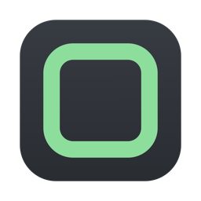

<p align="center">
  
</p>

# LabDock

**ESXi virtual machines from a native Mac app — power, snapshots, files, scripts and a live console, for standalone hosts without vCenter.**

LabDock talks to ESXi the way the host's own web client does: the vSphere API over HTTPS for
inventory and actions, VMware Tools for anything inside a guest, and the host's WebMKS stream
for the console. Everything is written in Swift — no `govc`, no third-party packages, no bundled
binaries. Several hosts sit in one sidebar; each VM gets the same slim tab bar.

## ⬇️ Download

[](https://github.com/bestonehxh/LabDock/releases/latest)

**[Get the latest release →](https://github.com/bestonehxh/LabDock/releases/latest)** — download `LabDock-2.0-1.zip`, unzip, and drag **LabDock.app** into `Applications`.

> The build is not notarized, so macOS will warn on first launch —
> right-click the app and choose **Open**, or allow it in System Settings › Privacy & Security.
>
> Requires macOS 26 (Tahoe) or later, Apple Silicon. Works with ESXi 8.0.x standalone hosts.

## Features

### Hosts and VMs
- **Several ESXi hosts in one sidebar**, each folded with its VMs; filter All / Running / Off
- **Certificate pinning** — the host's self-signed certificate is shown once (SHA-1 thumbprint)
  and remembered; a changed certificate stops the connection
- **Passwords in the Keychain** — one Keychain item for every host and guest login, asked for once
- Overview per VM: power and Tools state, guest OS and address, CPU / memory, network adapters

### Power and snapshots
- Power on / off / reset, suspend, and guest shutdown / reboot through VMware Tools
- Snapshot tree: take (with or without memory, quiesced), revert, delete one or all

### Inside the guest (VMware Tools)
- **Files** — copy files from the Mac into a guest folder, browse and download
- **Run** — run a command or script in the guest and read its output
- **Shell** — a persistent bash or PowerShell session inside the guest, no network needed
- **Paste to guest** — put the Mac clipboard on the guest's clipboard; ⌘V in the console pastes it
- **Shared clipboard** (opt-in) — copy in the guest, paste on the Mac, and back

### Console
- **Built-in console** on the host's WebMKS stream — no browser, no plug-in, no Flash
- Double-click a VM to open it; **⌘ works as Ctrl** inside the guest (⌘C, ⌘V, ⌘Z … land as the
  Windows / Linux shortcuts), Ctrl-Alt-Del, Windows key and function keys from the Keys menu
- The keyboard follows the mouse: hover the console to type, move away to stop
- Consoles of the VMs you visited stay connected in the background, so a Windows guest does not
  lock itself every time you switch VMs; the Overview shows the VM's *lock on disconnect* option
  and lets you turn it off
- Optional **Rewind** — record the console at up to 10 fps and scrub back through what happened
- Optional **guest follows window size** for guests with Tools (Windows and Linux desktops)
- A language chip warns when the Mac keyboard is not on a Latin layout (the console types US keys)

### Networking
- Edit a VM's network adapters: port group, adapter type, connected at power on
- Host networking: port groups, virtual switches and their uplinks

## Build from source

```sh
git clone https://github.com/bestonehxh/LabDock.git
cd LabDock
swift test                 # unit tests; the live tests skip unless LABDOCK_HOST/USER/PASS are set
Scripts/make-app.sh        # → build/LabDock.app
```

Swift 6, macOS 26 SDK. The package has four modules: `VimClient` (vSphere SOAP), `MKSClient`
(WebMKS / RFB console), `LabDockCore` (hosts, Keychain, app model) and the SwiftUI app.

## The Sheep family 🐑

LabDock sits next to a few small native macOS apps for network engineers:

|  | App | What it does |
|---|---|---|
|  | **[SheepTerm](https://github.com/bestonehxh/SheepTerm)**<br>[⬇️ Download](https://github.com/bestonehxh/SheepTerm/releases/latest) | SSH / Serial / local-shell terminal for network engineers |
|  | **[SheepText](https://github.com/bestonehxh/SheepText)**<br>[⬇️ Download](https://github.com/bestonehxh/SheepText/releases/latest) | Fast text editor with tree-sitter highlighting and a JavaScript plugin system |
|  | **[SheepDrop](https://github.com/bestonehxh/SheepDrop)**<br>[⬇️ Download](https://github.com/bestonehxh/SheepDrop/releases/latest) | SFTP / SCP / FTP / TFTP file transfer — client and built-in server |
|  | **[SheepTap](https://github.com/bestonehxh/SheepTap)**<br>[⬇️ Download](https://github.com/bestonehxh/SheepTap/releases/latest) | Menu-bar viewer for your Mac's network interfaces with click-to-copy |
|  | **[SheepPing](https://github.com/bestonehxh/SheepPing)**<br>[⬇️ Download](https://github.com/bestonehxh/SheepPing/releases/latest) | Continuous multi-host ping monitor with per-host logs and CSV export |
|  | **[SheepArt](https://github.com/bestonehxh/SheepArt)**<br>[⬇️ Download](https://github.com/bestonehxh/SheepArt/releases/latest) | Screenshot annotation — draw, crop, layers, one-key background removal |
|  | **[SheepRadius](https://github.com/bestonehxh/SheepRadius)**<br>[⬇️ Download](https://github.com/bestonehxh/SheepRadius/releases/latest) | RADIUS + LDAP lab for 802.1X, device logins and NAC — with a joinable Samba AD |
|  | **[SheepKey](https://github.com/bestonehxh/SheepKey)**<br>[⬇️ Download](https://github.com/bestonehxh/SheepKey/releases/latest) | Mac shortcuts (⌘ as Ctrl) inside AnyDesk, TeamViewer and RustDesk |
|  | **[LabDC](https://github.com/bestonehxh/LabDC)**<br>[⬇️ Download](https://github.com/bestonehxh/LabDC/releases/latest) | Active Directory–compatible domain controller with RADIUS for 802.1X and a lab CA |
|  | **[UncleSpy](https://github.com/bestonehxh/SheepLog)**<br>[⬇️ Download](https://github.com/bestonehxh/SheepLog/releases/latest) | Syslog viewer, SNMP tester and packet capture with TCP and 802.1X ladder diagrams — and a Troubleshoot page that reads all three |
|  | **[LabDock](https://github.com/bestonehxh/LabDock)**<br>[⬇️ Download](https://github.com/bestonehxh/LabDock/releases/latest) | VM control and console for standalone ESXi hosts — power, snapshots, guest files and scripts, no vCenter |

## License

MIT — see [LICENSE](LICENSE).
